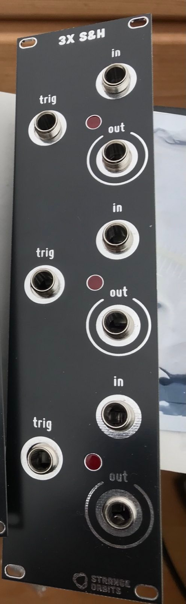

Triple Sample and Hold module based on the [Schmitzbits YASH](https://www.schmitzbits.de/sah.html). 
I changed some values to improve the droop rate, because I want to use it to sample CV and not audio.
If nothing is plugged into the inputs, it will sample white noise (should be 6V p2p, but you might tweak 
the values of resistors because it always depends on the transistor (reverse avalanche noise)

### Videos to show drop rate with different values for the S&H capacitor

https://www.youtube.com/watch?v=smofjtYN6VY

https://www.youtube.com/watch?v=RdAyaS16wt8

https://www.youtube.com/watch?v=JDEQTLfsh5g
